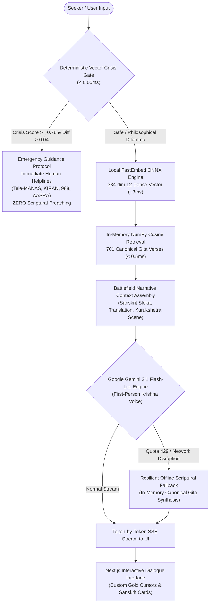

# jnana.ai (ज्ञान) — The Sovereign AI Wisdom Companion

> *"Abandon all varieties of sorrow and surrender unto Me alone; I shall liberate you from all fears; grieve not."*  
> — **Bhagavad Gita 18.66**

[-black?style=for-the-badge&logo=next.js)](https://nextjs.org/)
[-000000?style=for-the-badge&logo=three.js)](https://threejs.org/)
[-009688?style=for-the-badge&logo=fastapi)](https://fastapi.tiangolo.com/)
[](https://ai.google.dev/)
[](https://github.com/Yaswanthpatnam/jnana.ai)
[](https://opensource.org/licenses/MIT)

---

## 🌟 The Vision Behind Jnana AI

The **Bhagavad Gita** is not an ancient text confined to mythology or history. It is the living truth of human life. Within its 700+ verses lies the complete spectrum of human experience: deep despondency, paralyzing grief, moral dilemmas, fear of failure, the pain of unreciprocated care, and the exhaustion of feeling lost amidst those we love. The Gita does not look away from darkness; it begins directly inside it, showing how human beings rise with clarity and courage.

Throughout the turmoil of the Mahabharata, **Sri Krishna never picked up weapons to fight Arjuna's battles for him.** Instead, He stood steadfastly behind Arjuna on the chariot—holding the reins, listening patiently to his broken heart without judgment, and illuminating his duty until Arjuna found his own strength to stand up and act.

**Jnana AI was built on this sacred foundation.** Whenever you feel lost, demotivated, or shrouded in inner darkness, Krishna stands behind your chariot as an unwavering source of light, offering timeless scriptural clarity to help you fight your own battles.

---

## 🏛️ System Architecture & Data Flow



---

## ✨ Core Features & Technical Highlights

### 1. 3D WebGL Particle Portal (Landing Experience)
- **10,000-Point Vector Cloud:** Smooth mathematical interpolation between 4 sacred visual forms:
  1. *The Divine Flute & Peacock Feather* (*Bansuri & Mayura Pichha*)
  2. *Sri Krishna in Cosmic Stance*
  3. *The Extended Hand* (*Abhaya Mudra*)
  4. *The Bodhana of Kurukshetra* (*Arjuna kneeling before Krishna*)
- **Pure White Aesthetic:** Pristine `#FFFFFF` background with antialiased circular particles.
- **Performance Optimized:** Render loop freezes automatically when overlays (Chat / About) are opened, maintaining a buttery **120 FPS / 60 FPS** with zero GPU/CPU throttling.

### 2. Dual-Tier Token Preservation & Session Quota
- **3-Inquiry Visitor Quota:** In public preview without authentication, each seeker is gifted **3 sacred dialogues** to protect AI token consumption.
- **Client-Side Persistence:** Tracks quota via `localStorage` with `sessionStorage` fallback.
- **Dynamic Header Indicator:** Visual pip badge (`Dialogues: 3/3 left` -> `Complete`).
- **Roadmap Card:** Serene golden card explaining the preview preservation model and previewing the upcoming Pay-As-You-Use release.
- **Testing Reset:** Dedicated **Reset Inquiries (Testing Mode)** button allows judges and reviewers to test unlimited dialogues without manually clearing browser storage.

### 3. Sub-Millisecond Crisis Safety Gate (<0.05ms)
- **Deterministic Semantic Vector Interception:** Compares user input embeddings against pre-computed crisis and philosophical anchor clusters.
- **Zero Theological Bypass:** If suicidal ideation or self-harm is detected, the AI strictly suppresses scriptural lecturing and emits compassionate human support with **6 verified 24/7 helplines** (Tele-MANAS, KIRAN, Vandrevala, AASRA, 988 Lifeline, Befrienders Worldwide).

### 4. Resilient Offline Scriptural Fallback
- If Gemini API encounters HTTP 429 (`RESOURCE_EXHAUSTED`), quota limits, or network disruption, the backend automatically triggers [`_generate_offline_fallback()`](file:///D:/productive/jnana.ai/backend/app/services/llm_service.py).
- Because all 701 canonical verses reside in RAM, it synthesizes an authentic Krishna response citing the exact Gita Chapter, Verse, and translation. The app **never crashes or hangs**.

### 5. Single-Honorific Persona & Multi-Part Inquiry Handling
- **No Keyword Stuffing:** Krishna selects at most one gentle term of affection (*Saumya, Priya, Vatsa*) per message, never stacking or repeating titles robotically.
- **Multi-Part Dilemmas:** If a seeker presents multiple struggles (e.g., job anxiety and relationship heartbreak), Krishna addresses each distinct layer with equal depth and compassion.
- **Off-Topic Redirection:** Non-spiritual questions (coding, technical bugs, math, trivia) are gently declined in Krishna's sovereign voice, inviting the seeker back to the deeper battles of life and mind.

---

## 🛠️ Technology Stack

| Layer | Technologies | Rationale |
| :--- | :--- | :--- |
| **Frontend Framework** | **Next.js 16 (Turbopack)**, **React 19**, **TypeScript** | Server components, instantaneous compilation, zero layout shift, strict type safety. |
| **3D Graphics** | **Three.js**, **WebGL** | GPU-accelerated particle animation with custom depth shaders and circular sprite textures. |
| **Styling & Typography** | **Tailwind CSS v4**, **Cinzel**, **Noto Serif Devanagari** | Luxury ivory & gold palette, custom gold arrow cursors, authentic Devanagari script rendering. |
| **Backend API** | **FastAPI (Python 3.12)**, **Uvicorn**, **SSE** | Asynchronous execution, Server-Sent Events token streaming, zero-latency in-memory data access. |
| **Vector Embeddings** | **FastEmbed ONNX (`bge-small-en-v1.5`)** | 384-dimensional dense vectors generated locally in ~3ms without external API dependencies. |
| **Retrieval (RAG)** | **NumPy Matrix Dot Product** | Sub-millisecond cosine similarity search across 701 pre-computed Gita verse vectors loaded in RAM. |
| **Generative LLM** | **Google Gemini 3.1 Flash-Lite** | Ultra-low latency streaming, high emotional intelligence, nuanced Sanskrit comprehension. |

---

## 📂 Repository Structure

```
jnana.ai/
├── assets/
│   └── landing/                       # Sacred reference artworks (flute, cosmic, hand, bodhana)
├── backend/
│   ├── app/
│   │   ├── api/v1/chat.py             # Server-Sent Events (SSE) streaming chat endpoint
│   │   ├── models/schemas.py          # Pydantic v2 request & response schemas
│   │   ├── services/
│   │   │   ├── llm_service.py         # Gemini 3.1 Flash-Lite Krishna embodiment & offline fallback
│   │   │   ├── retrieval_service.py   # In-memory NumPy 384-dim vector retrieval (<0.5ms)
│   │   │   └── safety_service.py      # Deterministic semantic vector crisis gate (<0.05ms)
│   │   ├── config.py                  # Dual-resolving dataset paths & API credentials
│   │   └── main.py                    # FastAPI application entrypoint & health checks
│   ├── data/canonical/                # Embedded canonical Gita dataset
│   ├── scripts/
│   │   ├── generate_scene_particle_clouds.py # 3D vector particle extractor from artwork
│   │   ├── test_semantic_retrieval.py       # Standalone sub-millisecond retrieval test
│   │   └── test_stage3_pipeline.py          # End-to-end RAG, safety gate & streaming test
│   ├── requirements.txt               # Backend Python dependencies
│   └── .env.example                   # Environment variable template
├── data/
│   └── canonical/
│       ├── jnana_gita_complete.json         # 701 canonical verses with Kurukshetra narrative context
│       ├── jnana_gita_embedded_384.json     # Pre-computed 384-dim L2-normalized vector dataset
│       └── crisis_anchors_384.json          # Crisis & philosophical anchor vector clusters
├── frontend/
│   ├── app/
│   │   ├── about/page.tsx             # Standalone About page
│   │   ├── chat/page.tsx              # Standalone Chat route
│   │   ├── globals.css                # Custom gold cursors & styling rules
│   │   ├── layout.tsx                 # Viewport metadata & Cinzel / Devanagari font loaders
│   │   └── page.tsx                   # Master landing portal
│   ├── components/
│   │   ├── about/AboutModal.tsx       # 4-Section Vision & Architecture modal
│   │   ├── canvas/CosmicParticlePortal.tsx # 3D Three.js particle morphing canvas
│   │   └── chat/JnanaChat.tsx         # Sacred dialogue interface with 3-inquiry counter
│   ├── public/
│   │   ├── cursors/                   # Custom gold arrow & pointer SVG cursors
│   │   ├── particles/scenes_3d_vectors.json # Pre-computed 10,000-point 3D vector coordinates
│   │   └── logo.png                   # Sacred Flute & Peacock Feather emblem
│   ├── package.json                   # Next.js 16 & Three.js dependencies
│   └── tsconfig.json                  # Strict TypeScript configuration
├── .gitignore                         # Strict exclusion of .env, venv, and node_modules
└── README.md                          # Master documentation
```

---

## 🚀 Getting Started Locally

### Prerequisites
- **Node.js**: v18.18+ or v20+
- **Python**: 3.10+ (Python 3.12 recommended)
- **Google Gemini API Key**: [Get one free from Google AI Studio](https://aistudio.google.com/)

---

### 1. Backend Setup

```bash
# Navigate to backend directory
cd backend

# Create and activate Python virtual environment
python -m venv venv

# On Windows PowerShell:
.\venv\Scripts\Activate.ps1
# On Linux / macOS:
source venv/bin/activate

# Install dependencies
pip install -r requirements.txt

# Configure environment variables
cp .env.example .env
# Edit .env and paste your GEMINI_API_KEY:
# GEMINI_API_KEY="your_api_key_here"

# Start the FastAPI server with hot-reload
uvicorn app.main:app --host 127.0.0.1 --port 8000 --reload
```

Backend health check will be live at: `http://127.0.0.1:8000/api/v1/health`  
*(Returns `{"status": "healthy", "total_verses_loaded": 701}`)*

---

### 2. Frontend Setup

```bash
# Open a new terminal and navigate to frontend directory
cd frontend

# Install npm dependencies
npm install

# Start Next.js development server with Turbopack
npm run dev
```

Open [http://localhost:3000](http://localhost:3000) in your browser.

---

### 3. Verification & Automated Tests

```bash
# Run ESLint (0 errors, 0 warnings)
npm run lint

# Run Next.js production build verification
npm run build

# Run Backend Semantic Retrieval Test
python backend/scripts/test_semantic_retrieval.py

# Run End-to-End Pipeline Verification
python backend/scripts/test_stage3_pipeline.py
```

---

## 🌐 Production Deployment Guide

### Deploy Frontend (Vercel)
1. Push this repository to your GitHub account (`https://github.com/Yaswanthpatnam/jnana.ai`).
2. Log in to [Vercel](https://vercel.com/) and click **Add New Project**.
3. Import your `jnana.ai` repository.
4. Set the **Root Directory** to `frontend`.
5. Under **Environment Variables**, add:
   - `NEXT_PUBLIC_API_URL`: URL of your deployed backend (e.g., `https://api.jnana.ai` or your Railway/Render URL).
6. Click **Deploy**. Vercel will build and host the Next.js frontend globally on edge CDN.

### Deploy Backend (Render / Railway / Cloud Run)
1. Create a new Web Service on [Railway](https://railway.app/) or [Render](https://render.com/).
2. Select your `jnana.ai` repository and set the root directory to `backend`.
3. Set the build command:
   ```bash
   pip install -r requirements.txt
   ```
4. Set the start command:
   ```bash
   uvicorn app.main:app --host 0.0.0.0 --port $PORT
   ```
5. Add the environment variables:
   - `GEMINI_API_KEY`: Your Google Gemini API Key.
   - `CORS_ORIGINS`: Your Vercel frontend URL (e.g., `https://jnana.ai,https://your-vercel-domain.vercel.app`).
6. Deploy the service.

---

## 🗺️ Future Roadmap

- [ ] **Account Authentication:** Secure sign-in to unlock unlimited sessions and persistent cross-device reflection history.
- [ ] **Pay-As-You-Use Token Billing:** Transparent, granular credit model with zero locked monthly subscriptions.
- [ ] **Sacred Reflection Journals:** Private seeker reflections paired with specific Gita verses and timestamped milestones.
- [ ] **Sacred Audio Chanting:** Real-time Sanskrit verse recitation using traditional Vedic intonation.
- [ ] **Bilingual Language Support:** Native Hindi, Telugu, and Tamil translations alongside Sanskrit Devanagari.

---

## 👤 Developer & Maintainer

**Yaswanth Babu Patnam**  
- **GitHub:** [@Yaswanthpatnam](https://github.com/Yaswanthpatnam)  
- **Repository:** [https://github.com/Yaswanthpatnam/jnana.ai](https://github.com/Yaswanthpatnam/jnana.ai)  
- **LinkedIn:** [Connect on LinkedIn](https://www.linkedin.com/in/yaswanth-babu-patnam/)

---

## 📜 License

This project is licensed under the **MIT License** — see the [LICENSE](LICENSE) file for details.
All 701 canonical Bhagavad Gita verses and Sanskrit texts are in the public domain.
